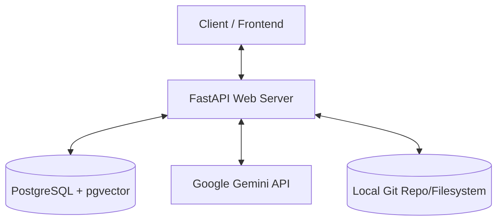

# Script Engine Backend - Technical Guide & Learning Roadmap

Welcome! This guide provides a comprehensive overview of the **Script Engine Backend** project architecture, its core technologies, where to learn more about them, and a step-by-step roadmap to build a similar project from scratch.

---

## 1. Project Overview & Architecture

The **Script Engine Backend** is a local-first, reuse-centric script generation engine powered by FastAPI (Python), PostgreSQL (`pgvector`), and the Google Gemini API.

Instead of generating scripts from scratch every time (which is slow and expensive), this system:
1. Receives a user's request (e.g., *“Convert CSV schema to JSON”*).
2. Generates a **semantic embedding** of the request's intent.
3. Performs a **vector similarity search** against a database of previously approved, high-quality scripts.
4. If a highly similar script is found (similarity $\ge 0.8$), it reuses it directly or uses it as a template (saving time and money).
5. If no match is found, it uses the Google Gemini LLM to generate a brand new script, runs checks on it, and stores it in the database for future reuse.

### Architecture Diagram


---

## 2. Directory Structure & Key Components

Here is how the project files are organized:

* **[run.py](file:///C:/Users/deepa/projects/scriptengine-backend/run.py)**: The entry point that runs the local Uvicorn development server.
* **[app/](file:///C:/Users/deepa/projects/scriptengine-backend/app)**: Main application directory.
  * **[app/main.py](file:///C:/Users/deepa/projects/scriptengine-backend/app/main.py)**: Initializes the FastAPI app, configures CORS, registers routers, and runs the database setup on startup.
  * **[app/config.py](file:///C:/Users/deepa/projects/scriptengine-backend/app/config.py)**: Manages all project configuration and loads settings from [.env](file:///C:/Users/deepa/projects/scriptengine-backend/.env).
  * **[app/database.py](file:///C:/Users/deepa/projects/scriptengine-backend/app/database.py)**: Manages connection to PostgreSQL database, defines the database models (`ApprovedScript` and `User`), and initializes tables automatically.
  * **[app/routers/](file:///C:/Users/deepa/projects/scriptengine-backend/app/routers)**: Contains the API routes mapping HTTP methods to service controllers.
    * [auth.py](file:///C:/Users/deepa/projects/scriptengine-backend/app/routers/auth.py): User signup and login (JWT token authentication).
    * [scripts.py](file:///C:/Users/deepa/projects/scriptengine-backend/app/routers/scripts.py): Managing, creating, updating, and executing scripts.
    * [search.py](file:///C:/Users/deepa/projects/scriptengine-backend/app/routers/search.py): Vector-based script search endpoints.
  * **[app/services/](file:///C:/Users/deepa/projects/scriptengine-backend/app/services)**: Encapsulates all business logic.
    * [search_service.py](file:///C:/Users/deepa/projects/scriptengine-backend/app/services/search_service.py): Embedding generation and similarity search using SQL query `1 - (embedding <=> :embedding::vector)`.
    * [ingestion.py](file:///C:/Users/deepa/projects/scriptengine-backend/app/services/ingestion.py): Handles indexing existing scripts in bulk.
  * **[app/llm/](file:///C:/Users/deepa/projects/scriptengine-backend/app/llm)**: Wraps interactions with the LLM.
    * [gemini_client.py](file:///C:/Users/deepa/projects/scriptengine-backend/app/llm/gemini_client.py): Configure and call Gemini models (`gemini-2.5-flash` for generations, `embedding-001` for vectors) with automatic quota error fallback.

---

## 3. Technology Stack & Key Concepts

To build this project, you need to understand the following key technologies:

### 1. Python & FastAPI
FastAPI is used to build high-performance REST APIs. It utilizes Pydantic for input validation and generates automatic API documentation (available at `/docs`).
* **Key Concept**: Dependency Injection (`Depends(get_db)`) to inject database sessions into routes cleanly.

### 2. Relational Database with pgvector
Instead of using a separate vector database (like Pinecone or Milvus), this project uses **PostgreSQL** with the **pgvector** extension. This allows standard relational tables (`users`, `scripts`) and embedding vectors (`vector(1536)`) to live side-by-side.
* **Key Concept**: Cosine Similarity. Under the hood, pgvector uses the `<=>` operator to calculate cosine distance:
  $$\text{Cosine Similarity} = 1 - \text{Cosine Distance}$$

### 3. Google Gemini API
Gemini is used for two purposes:
1. **Generating Text Embeddings**: Converting script intents into 1536-dimensional float arrays via `models/embedding-001`.
2. **Generating Code/Scripts**: Processing prompts using `gemini-2.5-flash` or `gemini-1.5-flash` to write Python, Bash, or SQL scripts based on instructions.

### 4. SQLAlchemy ORM
SQLAlchemy acts as a bridge between Python objects and your PostgreSQL database, facilitating table definitions as classes (`DeclarativeBase`) and executing queries.

---

## 4. Learning Resources & Documentation

To master these technologies and build similar projects, use the following resources:

| Technology | Best Learning Source | Link |
| :--- | :--- | :--- |
| **FastAPI** | Official FastAPI Tutorial (highly recommended) | [FastAPI Docs](https://fastapi.tiangolo.com/tutorial/) |
| **Pydantic** | Modern Python data validation | [Pydantic Docs](https://docs.pydantic.dev/) |
| **SQLAlchemy** | Unified ORM & SQL tutorials | [SQLAlchemy Docs](https://docs.sqlalchemy.org/en/20/) |
| **pgvector** | Understanding vector storage in PostgreSQL | [pgvector GitHub](https://github.com/pgvector/pgvector) |
| **Gemini API** | Generative models & embeddings | [Google Gemini Developers Guide](https://ai.google.dev/gemini-api/docs) |
| **Vector Search** | Conceptual guide to vector embeddings & similarity | [Pinecone Vector Search Learning](https://www.pinecone.io/learn/vector-embeddings/) |
| **Docker** | Creating containerized environments | [Docker Get Started](https://docs.docker.com/get-started/) |

---

## 5. Step-by-Step Roadmap to Build a Similar System

If you want to build a similar AI-powered search and generation engine from scratch, follow these stages:

```mermaid
chronology
    title Backend Development Stages
    setup : Setup Environment & Docker (FastAPI + pgvector container)
    database : Database Schema (SQLAlchemy Models, init script, migrations)
    auth : Authentication Layer (JWT, Password Hashing, Sign-up/Login)
    gemini : Gemini Integration (Configuring Client, Embeddings, Completion)
    search : Similarity Engine (Writing pgvector search queries)
    api : Script Management API (CRUD routes, script execution logic)
    ingestion : Ingestion & Seed Scripts (Populating database with base scripts)
```

### Stage 1: Setup Environment & Database Container
1. Create a Python project structure and create a virtual environment (`python -m venv .venv`).
2. Add a `docker-compose.yml` to launch PostgreSQL with `pgvector` pre-installed:
   ```yaml
   services:
     db:
       image: pgvector/pgvector:pg16
       ports:
         - "5432:5432"
       environment:
         POSTGRES_DB: mydatabase
         POSTGRES_USER: postgres
         POSTGRES_PASSWORD: mypassword
   ```

### Stage 2: Connect via SQLAlchemy
1. Install `sqlalchemy`, `psycopg2-binary`, and `pgvector` Python packages.
2. Build your Settings class utilizing `python-dotenv` to parse variables.
3. Write database connection logic (`engine`, `SessionLocal`, and a database context helper `get_db()`).
4. Define your models, ensuring your vector columns use the `Vector(dimension)` type:
   ```python
   from pgvector.sqlalchemy import Vector
   embedding = Column(Vector(1536))
   ```

### Stage 3: Setup FastAPI & Auth Router
1. Create a `main.py` and register routers.
2. Implement user sign-up and login endpoints using `passlib` for password hashing and `python-jose` to generate JWT tokens.

### Stage 4: Integrate the Gemini API
1. Install `google-generativeai`.
2. Write a wrapper client class that takes your `GEMINI_API_KEY` from the environment.
3. Create helper functions:
   * `embed(text)`: Calls `genai.embed_content(model="models/embedding-001", content=text)`.
   * `generate_code(prompt)`: Calls `model.generate_content(prompt)` to write scripts.

### Stage 5: Implement Vector Similarity Search
1. Write a service function that takes a search term, embeds it, and performs a raw SQL or ORM cosine similarity query.
2. In SQL: `1 - (embedding <=> :user_embedding::vector) as similarity`.
3. Filter by `similarity >= threshold` to return matches.

### Stage 6: Build Endpoints and Ingest Scripts
1. Create REST endpoints for creating scripts, retrieving them, and searching.
2. Write a utility script to read local files, call the Gemini embedding function, and save them directly to the database.

---

*This guide was generated to assist you in mastering the architectural stack behind the Script Engine project. Happy Coding!*
